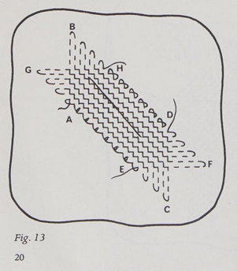
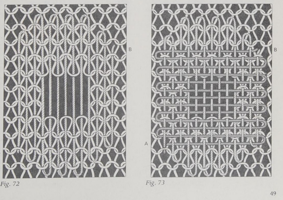
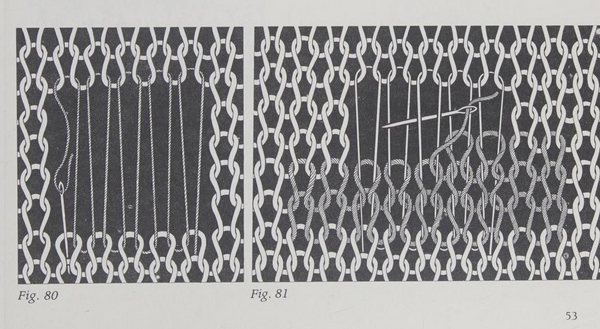
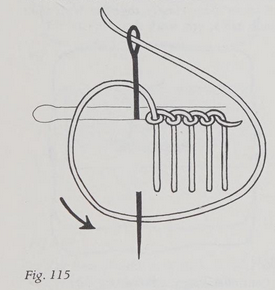
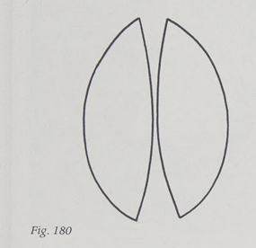

> Goldsworthy Maureen. _Mend It! : A Complete Guide to Clothes Repair_. Stein and Day 1979.

Read November 2023. Available to borrow on [OpenLibrary](https://openlibrary.org/works/OL5655017W/Mend_it%21?edition=key%3A/books/OL4402367M)

This book has a focus on invisible mending.

> Machine-worked darns and patches are almost always preferable to hand-worked ones; as well as being less visible, they are usually stronger - p9

## Darning

> Darning may be defined as the introduction of new threads to reinforce those that are worn, or to replace those that are broken. - p15

It's always preferable to darn before there's actually a massive hole! Usually that means the work can be done quicker, and be more invisible.

Begin darns with laying threads parallel to the warp on woven fabrics, or the wale of knit fabrics. Darn big enough so that you're working into undamaged fabric at the edges - if you add a firm darn to weak fabric, it will probably tear at the join. Prefer rounded shapes, so that you don't place extra strain on any single warp or weft thread. Match the colour, thickness and texture of the thread used to darn, although you may prefer to use a different fibre blend, specifically some % of synthetic for stronger repairs on natural fibres. You can make darns in various weaving patterns, including twills and damask if they match the fabric you are repairing.

If you're darning a tear that goes with the warp or weft direction, there's not usually much damage to the surrounding fabric so you can keep the darn pretty narrow and just work over the tear. If there's a cross-cut, you need to darn a larger area to prevent fraying.

If you're darning on a machine, you probably want to use a hoop or something to keep the fabric taut and prevent puckering. For reinforcing thinning fabric, work straight stitches back and forth, either with sharp corners or in long overlapping figure-8 shapes.

If you're darning a small hole, run stitches around the perimeter of the hole first, then work straight stitches over the hole in the warp then weft direction. The stitches themselves should be close enough to mimic fabric and close the hole. If it's a large hole, do the same but with a patch.

Tears and cross-cuts you can mostly just work over with a zigzag stitch, maybe with a bit of backing fabric for stability.

## Patching

Patches should be cut with the warp and weft of the fabric into a square or rectangular shape, to prevent fraying.

You might be able to take some fabric from the garment itself (in an inconspicuous place like a pocket, waistband or facings), or from a similar garment that is beyond repair. If you made the garment, keep your fabric scraps to use for this. You can apply patches from the back (felled) or front (oversewn) of the garment.

If the fabric is a woven with threads thick enough to see, and you have some of the same fabric, you can fray the edge of a patch and actually weave the frayed edges into the existing fabric rather than sewing. This takes ages, but is very neat. Usually you'd do it on suiting or coats.

You can patch by machine too, it's usually quicker and not less neat on bigger patches. Remember to turn the raw edges of your hole inside.

## Repairing knits

Match your yarn thickness as closely as possible. Work darns from the inside. When darning stocking stitch, reinforce some surrounding area (remember to make it round!) and weave over the hole.

If a thread has been pulled out, you can graft it back in, in the same way as you do a normal graft/kitchener stitch.

Swiss darning can be used for something more invisible, which imitates knit stitches rather than woven fabric. If your hole is a bit bigger, you might want to include some threads going from the top to bottom of the hole first, as a way to support the swiss darns as you work. Fold the left and right edges to the back and secure first.

But if your hole is any reasonable size, just pick up and knit a patch in place, grafting the final row to the garment, and doing a tiny swiss darn to join in each side.

## Repairing garments

Generally, if you have enough spare fabric, replacing a whole panel of a garment with new fabric will be neater than doing a patch or darn. Particularly if its a specialised fabric like leather.

If you have damage near a seam and some spare room in the garment, just take it in at the seam and hide the damage in the seam.

You can repair split seams if just the thread has gone using mattress stitch. You can darn or patch at the end of a buttonhole if it has torn, then rework the bit of buttonhole that broke, using the tailor's buttonhole stitch.

You can replace entire zips, but it's fiddly! The process is basically the same as putting a zip in normally.

It usually isn't worth darning pockets, just replace the pocket bag.

Elbow patches should be this shape, overlap them slightly at the centre seam, and sew them on while the garment is on an arm-shaped thing to keep the bendy shape.

