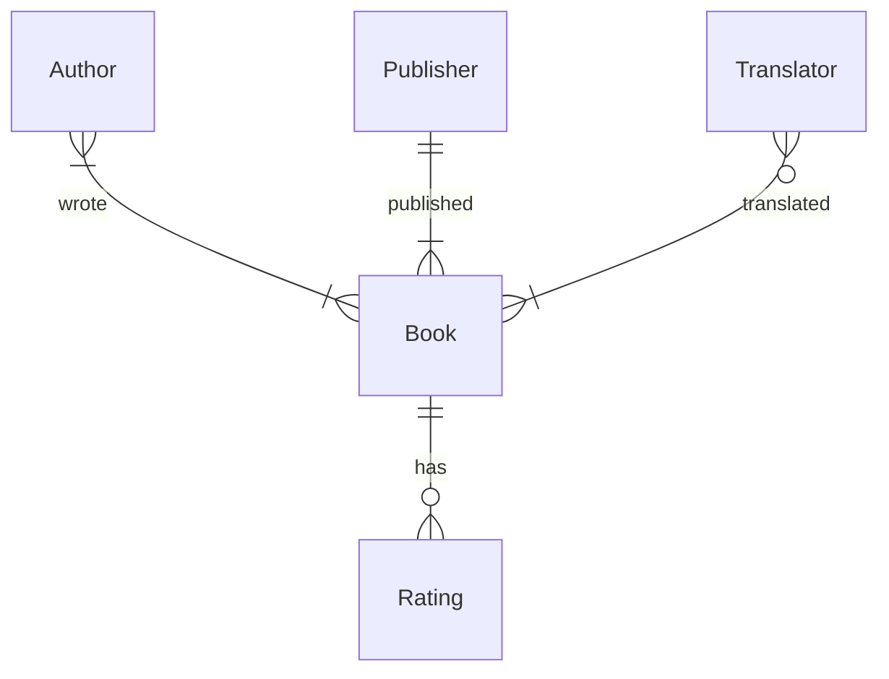

Often it's useful to visualise the relationships between your tables in a [[Relational databases usually have several tables with related data|relational database]]. These diagrams are called entity relationship diagrams. You can draw these using [mermaid](https://mermaid.js.org/syntax/entityRelationshipDiagram.html), which Obsidian supports natively - here's one for the example booker database.

The boxes represent your entities, or tables in your database. The type of relation one-to-one, one-to-many, many-to-many are captured by the "crow's foot notation" for the arrows. We can choose to name the relation arrows to help with domain words.

These diagrams can be a good place to start when designing a database schema for your domain and data set.